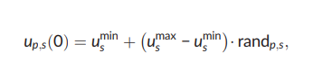
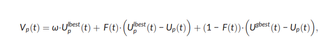
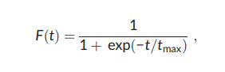
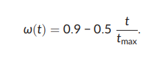
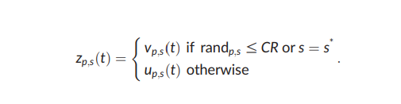
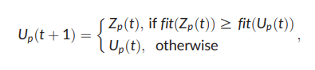
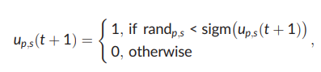
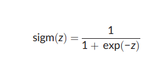
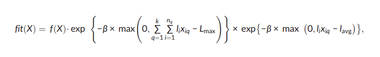

# Сosum
COSUM: Text summarization based on clustering and
optimization

Text summarization is a process of extracting salient information from a source text
and presenting that information to the user in a condensed form while preserving
its main content. In the text summarization, most of the difficult problems are providing wide topic coverage and diversity in a summary. Research based on clustering,
optimization, and evolutionary algorithm for text summarization has recently shown
good results, making this a promising area. In this paper, for a text summarization, a
two‐stage sentences selection model based on clustering and optimization techniques, called COSUM, is proposed.


# Step One
## Vectorize


Let `T = {t1, t2, …, tm}` represents all the distinct terms occurred in the document D, where m is the number of terms. Using the vector space model,
each sentence Si is represented as a vector in m‐dimensional space, `Si = [wi1, …, wim]`, i = 1, …, n, where each component reflects weight of a corresponding term. Different weighting schemes are available.


## Example:
Get tokens and compute weight

```python
from cosum import computeFullWeight


text = "This is sentence one. This is sentence three. This is sentence four. This is sentence five."

vectorizer = CosumTfidfVectorizer()
vectorizer.fit(text)
vector = vectorizer.weight_matrix
print(vector)

// Out: 
[[0.0, 0.28669523396569635, 0.0, 0.0, 0.0], [0.0, 0.0, 0.28669523396569635, 0.0, 0.0], [0.0, 0.0, 0.0, 0.28669523396569635, 0.0], [0.0, 0.0, 0.0, 0.0, 0.28669523396569635]]
```

# Step Two
## Clustering

After representation of sentences, now we can calculate the similarity between them. Intuitively, if there are many common words between
two sentences, they are very similar. Let given two sentences `Si = [wi1, …, wim]` and `Sj = [wj1, …, wjm]`. Then to measure similarity between them, we
use the following measure:


## Example:
Compute clustering sentence

```python
vectorizer = CosumTfidfVectorizer()
vectorizer.fit(text)
vector = vectorizer.weight_matrix

# Computing centroids
print("Стартуем кластеризацию ...")
kmeans = K_means(K, max_iterations=100000)
for i in range(1000):
    try:
        kmeans.fit(vector, metric="similarity")
        break
    except ZeroDivisionError:
        print("Попытка #", i)
print("Класстеризация завершена ...")
```

# Step Three
## Genetic algorithm

The basic DE (Das & Suganthan, 2011; Storn & Price, 1997) is a population‐based global optimization method that uses a real‐coded representation. Like the other evolutionary algorithms, DE also starts with a population of P n‐dimensional search variable vectors. The pth individual vector
of the population at generation t has n components, Up(t)=[up, 1(t), …, up, n(t)], where up, s(t) is the sth decision variable of the pth chromosome in
the population, s = 1, 2, …, n; p = 1, 2, …, P.
In literature, these vectors are referred as “genomes” or “chromosomes.” In the initialization procedure, P solutions will be created at random
to initialize the population. At the beginning of a DE run, independent variables of problem are initialized in their feasible numerical range.

`Up(t)=[up, 1(t), …, up, n(t)]`

```python
vectorizer = CosumTfidfVectorizer()
vectorizer.fit(text)
vector = vectorizer.weight_matrix

# X = [1,2,4,1,2,3,5,7,2]  This is number of cluster
X = kmeans.labels
clusterSentence = clusteringSentence(X)

# Start compute genetic algorithm
print("Старт генетического алгоритма ...")
genetic = Ga(t_max=1000, pop_size=200)
genetic.fit(vector, kmeans.cq, kmeans.centroids, l_avg, clusterSentence, K)
print("Рассчет генетического алгоритма завершена ...")
```

### Step 1. Initialize
If the sth variable of the given problem has its lower and upper bound as umin
s and umax
s , respectively, then the sth component of the pth population member Up(t) may be initialized as
where randp, s is a random number between 0 and 1, chosen once for each s ∈ {1, 2, …, n}.




### Step 2. Modified mutation operator
DE is based on a mutation operator, which adds an amount obtained by the difference of two randomly chosen individuals of the current population, in contrast to most of the evolutionary algorithms, in which the mutation operator is defined by a probability function. Mutation expands
the search space. In each generation to change each population member, a mutant vector is created.



### Step 2.1
where ω is the inertia weight, U gbest(t) is the global best solution of population and Ulbest
p ð Þt is the local best solution of the pth individual during t
generation, respectively, and F (t) is the scaling factor:



### Step 2.2
where t is the current generation and tmax is the maximum number of generations.
The inertia weight ω is linearly decreased from 0.9 to 0.4 (Das & Suganthan, 2011):




### Step 3. Crossover 
In order to increase the diversity of the perturbed parameter vectors, a crossover operator is introduced. The parent vector Up(t) is mixed with the
mutated vector Vp(t) to produce a trial vector `Zp(t)=[zp, 1(t), …, zp, n(t)]`. It is developed from the elements of the target vector,Up(t), and the elements of the mutant vector, Vp(t):



CR ∈ [0, 1] is the crossover constant that controls the recombination of target vector and mutant vector to generate trial vector, and
s
* ∈ { 1, 2, …, n } is the randomly chosen index that ensures at least one element from mutant vector is obtained by the trial vector; otherwise, there
is no new vector would be produced, and the population would not evolve.

### Step 4. Selection 

The target vector (Up(t)) or trial vector (Zp(t)) that
generates a better solution will be selected as the target vector of the next generation (Up(t + 1)). 



### Step 5. Binarization 

Binary DE is the modified version of DE that operates in binary search spaces. In the binary DE, the real value of genes is converted to the binary
space by the rule




The motivation to use the sigmoid function is to map interval umin
s ; umaxs for each s ∈ {1, 2, …, n} into the interval (0, 1), which is equivalent to the interval of a probability function. After such transformation from the real‐coded representation, we obtain the binary‐coded representation,
up, s(t) ∈ {0, 1}, where the up, s(t) = 1 indicates that the sth sentence is selected to be included to the summary; otherwise, the sth sentence is not be selected. For example, the individual Up(t) = [1, 0, 0, 1, 1] represents a candidate solution that the first, fourth, and fifth sentences are selected to be
included in the summary
Sigmoid function




### Step 6. Fitness

The first multiplier f (X) in Equation (24) is the objective function (9). The second multiplier is defined as an additional penalty function for
maximization. β represents the cost of overloaded summary. Initial value of β is set by the user. If a solution is not feasible, the second term will
be less than 1, and therefore, the search will be directed to a feasible solution. If the summary length is not exceeded, this term will be equal to 1 to ensure that the solution is not to be penalized.


