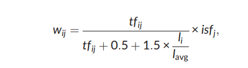
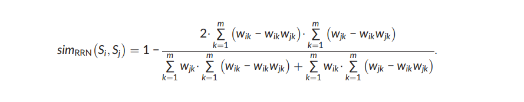
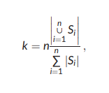

# cosum
COSUM: Text summarization based on clustering and
optimization

Text summarization is a process of extracting salient information from a source text
and presenting that information to the user in a condensed form while preserving
its main content. In the text summarization, most of the difficult problems are providing wide topic coverage and diversity in a summary. Research based on clustering,
optimization, and evolutionary algorithm for text summarization has recently shown
good results, making this a promising area. In this paper, for a text summarization, a
two‐stage sentences selection model based on clustering and optimization techniques, called COSUM, is proposed.


# Step One


Let `T = {t1, t2, …, tm}` represents all the distinct terms occurred in the document D, where m is the number of terms. Using the vector space model,
each sentence Si is represented as a vector in m‐dimensional space, `Si = [wi1, …, wim]`, i = 1, …, n, where each component reflects weight of a corresponding term. Different weighting schemes are available.




## Example:
Get tokens and compute weight

```python
from cosum.cosum import computeFullWeight


text = "This is sentence one. This is sentence three. This is sentence four. This is sentence five."

tokens = computeFullWeight(text)
print(tokens)

// Out: 
[[0.0, 0.201, 0.0, 0.0, 0.0], [0.0, 0.0, 0.201, 0.0, 0.0], [0.0, 0.0, 0.0, 0.201, 0.0], [0.0, 0.0, 0.0, 0.0, 0.201]]
```

# Step Two

After representation of sentences, now we can calculate the similarity between them. Intuitively, if there are many common words between
two sentences, they are very similar. Let given two sentences `Si = [wi1, …, wim]` and `Sj = [wj1, …, wjm]`. Then to measure similarity between them, we
use the following measure:



## Example:
Compute similarity with sentence #1 and sentence #2

```python
from cosum.cosum import computeFullWeight
from cosum.cosum import compute_sim_opt


text = "The rest of this paper is organized as follows. Section 2 introduces the overview of related work. In Section 3, mathematical formulation of sentence selection problem for text summarization is introduced. It first segregates the sentences into clusters by topics, and then, the sentence selection problem from each cluster is formulated as an optimization problem. Section 4 presents a modified DE algorithm for solving the optimization problem."
tokens = computeFullWeight(text)
for i in range(len(tokens)):
    for j in range(len(tokens)):
        print("Similarity(S,",i,",","S",j,")",compute_sim_opt(tokens[i],tokens[j]))

// Out: 
Similarity(S, 0 , S 0 ) 0.305
Similarity(S, 0 , S 1 ) 0.0
Similarity(S, 0 , S 2 ) 0.0
Similarity(S, 0 , S 3 ) 0.0
Similarity(S, 0 , S 4 ) 0.0
---
Similarity(S, 4 , S 1 ) 0.005
Similarity(S, 4 , S 2 ) 0.008
Similarity(S, 4 , S 3 ) 0.014
Similarity(S, 4 , S 4 ) 0.202
```

# Step Three
## Clustering

In this stage, the sentences are clustered into different groups to discover latent subtopic information in the document D. Generally, automatic
clustering is a process of dividing a set of objects into unknown groups, where the clustering algorithm determines the best number k of groups
(or clusters). That is, objects within each group should be highly similar to each other than to objects in any other group. The automatic clustering
problem can be defined as follows.

`X = {x1, x2, …, xn}`

`U = [uiq] (i = 1, 2, …, n and q = 1, 2, …, k)`

### Step 1. 
Let k be the number of clusters. In this study, it is defined by Equation (8).




### Step 2. 
Initialize the centres to k random locations in the collection D = {S1, …, Sn} and calculate the mean centre of each cluster, Oq, where Oq is the centre of cluster Cq.
### Step 3. 
Calculate the similarity from the centre of each cluster to each input sentence vector, and assign each input sentence vector to the cluster where the similarity between itself and Oq is maximal. Recompute Oq for all clusters that have inherited a new input sentence vector, and update each cluster centre (if there are no changes within the cluster centres, discontinue recomputation).
### Step 4. 
Repeat Step 3 until all the sentences are assigned to their optimal cluster centres. This ends the cluster updating procedure with k disjoint subsets.